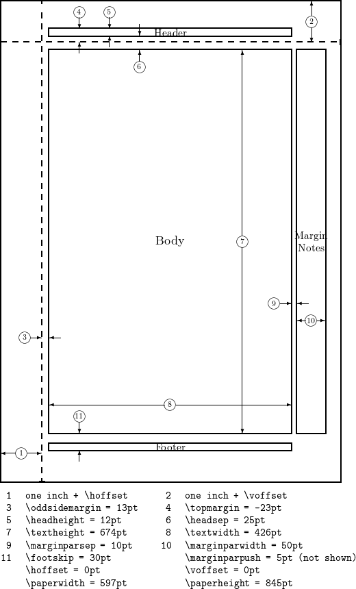

## geometry

controls page size and margin

### include options

### commands

- `\geometry{margin=..., left=..., right=..., top=..., bottom=...}`

### values

attributes set by `\setlength` :

## newtxtext

math font provider, universal to all tex engines

> `newtx` family includes newtxtext, newtxmath, etc.

> `miktex` does not handle dependencies correctly(2026.1.23). should manually install both `newtx` and `newtxsf`, otherwise a font not found problem panics.

## amsmath

AMS-Latex's math package. see [its document](https://mirrors.rit.edu/CTAN/macros/latex/required/amsmath/amsldoc.pdf). (AMS: American Mathematical Society)

it provides: 

- basic alignment, matrix, spacing and numbering: `equation`, `align`, `align*`, `subequations`, `matrix`, `case`, `theorem`, ...
- complex substitutes: `sin`, `lim`, `binom`, `dots`, `xrightarrow`, `boxed`, ...

## graphicx

support image access and transform and layout control. see [its document](https://us.mirrors.cicku.me/ctan/macros/latex/required/graphics/grfguide.pdf)

> requires tex driver(engine) to support dvi drawing

### commands

- `\includegraphics[width = ..., height = ..., angle = ..., origin = ..., scale = ...,[clip, trim = l b r t] [keepaspectratio], ...]{<image-path>}`
- `\begin{figure}[[h][t][b][p]]` : a figure with image, caption and ref(label)
- `\graphicspath` : default paths for searching images

## xcolor

## caption

control the behavior of caption

### commands

- `\captionsetup{width = ...}`

### examples

## subcaption

provides subfigure type and catpion format

## booktabs
